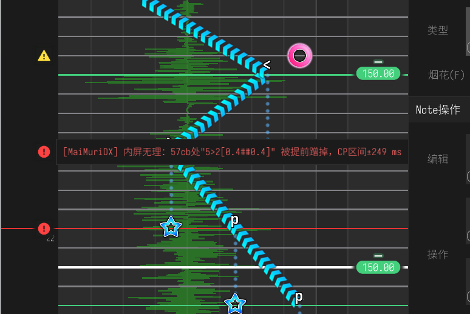

# VisualMaimai-Integration-MaiMuriDX

面向 [Visual Maimai](https://github.com/CH3COOOHH/Visual-Maimai-Release) 谱面编辑器的 MelonLoader Mod，将 [MaiMuriDX](https://github.com/Minepig/MaiMuriDX) 的无理检测能力接入编辑器内置的「谱面检查」流程。在 VM 原有检查之外，额外报告内屏、多押、叠键、外键、撞尾等 DX 谱面无理问题。
> 妈妈再也不怕我写谱写出无理了！

## 功能
- 编辑谱面时自动实时触发检测，无需手动操作
- 结果合并显示进VisualMaimai内置的无理报告，实现类原生的体验

## 使用方法
1. 先决条件：
   - 安装[Visual Maimai](https://github.com/CH3COOOHH/Visual-Maimai-Release)（废话）
   - 给你的Visual Maimai安装[MelonLoader](https://melonloader.co/download.html)。
     - 具体而言，从上面的链接下载到的是MelonLoader的安装器，下载后运行、选择Visual Maimai的游戏目录，再进行安装即可。
   - 安装[Python](https://www.python.org/downloads/)。
     - 我测试的版本为3.12，但理论上只要别太低的版本应该都可以。
     - MaiMuriDX的CLI模式下并没有依赖任何外部库，因此你不需要配置独立的环境或者安装任何依赖之类的。只要把Python本体安装好就行了。
2. 从Release里下载编译好的文件
   - 下载到的压缩包中包含一个`VisualMaimai-Integration-MaiMuriDX.dll`文件和一个`MaiMuriDX`文件夹。
   - 将它们俩并列放在`<Visual Maimai的安装路径>/Mods`里即可。
   - 当然你也可以自己编译：
     - 由于本项目有submodule，`git clone`的时候记得加`--recursive`参数。
     - 需要**修改`csproj`文件中的`VMRootDir`属性**指向你VisualMaimai的安装路径，不然会无法找到VM的DLL也就无法编译。
     - 然后直接`dotnet build`就可以。
3. 打开Visual Maimai，enjoy！
   - 仓库里附带了一个`muri-example.txt`，是AI生成的一个全是无理的谱面样例，如果你想的话可以自行用作测试。
